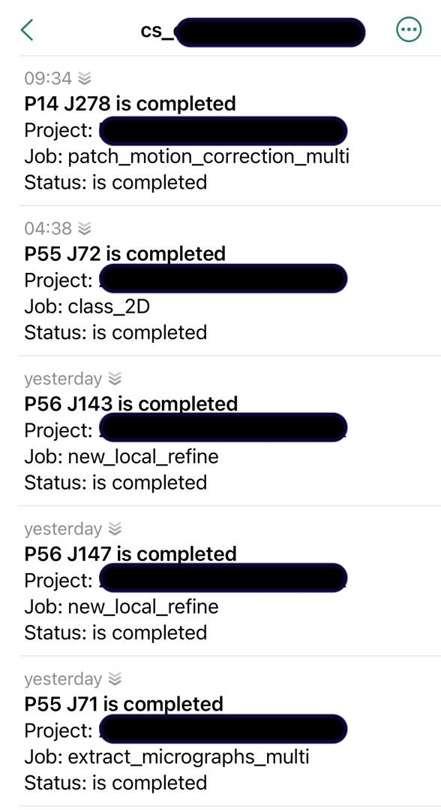

# ntfy_cryosparc

Very simple HTTP server in pure python for processing local cryosparc notifications and posting them to a ntfy.sh channel.
It sends a push notification when a job that you've created, has completed (see [Screenshots](/Screenshots). 
If it fails to process a message from CryoSPARC instance, it sends respective notification to an admin channel.

| :exclamation:  Warning   |
|--------------------------|

You can easily use this server with a default ntfy.sh server, but remember that anyone can potentially read messages there, and thereby have access to your project names in your CryoSPARC instance, if they guess your channel name. 
We personally use security-by-obscurity -- our `hostname` is a combination of random chars that is almost impossible to guess and hence find. 
However, if you think it's not enough for you, you can consider running a self-hosted version of ntfy.sh: [instructions](https://docs.ntfy.sh/install/).

## Installation

1. Set the variable `CRYOSPARC_SLACK_WEBHOOK_URL` in your `config.sh (see [cryosparc documentation](https://guide.cryosparc.com/setup-configuration-and-management/management-and-monitoring/environment-variables#cryosparc_master-config.sh) and [my thread](https://discuss.cryosparc.com/t/push-notifications-for-long-jobs/9827/2) on discuss forum). Note that you must restart your cryosparc instance after that.

Namely, your `config.sh` should contain this line:

```bash
export CRYOSPARC_SLACK_WEBHOOK_URL="http://localhost:8000"
```

2. Login as `cryosparcuser` on your master node
3. Clone the repo and start the script:

```
git clone https://github.com/marinegor/ntfy_cryosparc.git
cd ntfy_cryosparc.git
cryosparcm call python3 server.py
```
4. Install ntfy app on your mobile (iOS, Android) and add your channel there. It would look like this: <url>/cs_<hostname>_<username>, where:

 - url -- ntfy server (default would be ntfy.sh)
 - hostname: your master node name (can be changed, but equals to `hostname` of master node)
 - username: can be found in your profile settings on CryoSPARC web-interface (or you can ask your admin about it).


## Usage

Usage:

```
usage: cryosparcm call python3 server.py [-h] [--url URL] [--admin ADMIN] [--hostname HOSTNAME]

optional arguments:
  -h, --help           show this help message and exit
  --url URL            location of ntfy server (change from default if you're
                       self-hosting it (default: https://ntfy.sh)
  --admin ADMIN        username for admin messages (like when a notification
                       is failed to get parsed) (default: admin)
  --use_user USE_USER  whether you want to send messages to each user separately
                       or instead send them to a single channel (default: true, sends them separately)
  --hostname HOSTNAME  master node hostname, is used in notification channel
                       name: <url>/cs_<hostname>_<username> (default: cmm-1)
```

You can check if the notifications are actually sent via interrupting a `server.py` with Ctrl+C -- it sends a test notification to the admin channel before finishing the process.

## Screenshots
After you've set it up running, your channel would look somewhat like this:


